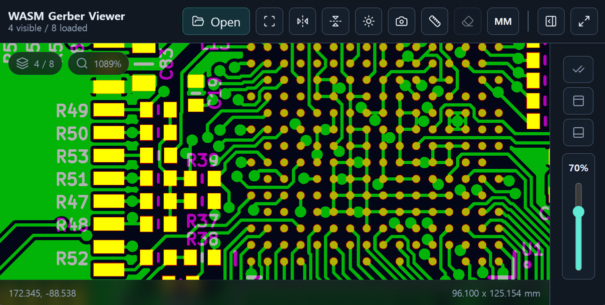

# wasm-gerber-viewer

WASM/WebGL2-based Gerber file viewer for PCB visualization.



Website:

- [Viewer](https://wasm-gerber-viewer.vercel.app/)
- [Sample 1: KLP-5e ESP32 Sensor Board](https://wasm-gerber-viewer.vercel.app/?url=https%3A%2F%2Fraw.githubusercontent.com%2Ffutureshocked%2FKLP-5e-ESP32-sensor-board%2Fmain%2FKiCad%2520project%2Fdfm%2Fgerber.zip)
- [Sample 2: Xassette-Asterisk](https://wasm-gerber-viewer.vercel.app/?url=https%3A%2F%2Fprocessor-cdn.kitspace.org%2Fv6%2FSdtElectronics%2FXassette-Asterisk%2F6ccd88501c99e2339571de744d003d571be47fad%2F_%2FXassette-Asterisk-6ccd885-gerbers.zip)
- [Sample 3: OtterCastAmp](https://wasm-gerber-viewer.vercel.app/?url=https%3A%2F%2Fprocessor-cdn.kitspace.org%2Fv6%2FOttercast%2FOtterCastAmp%2F0b5f7f9a8e4e43a5d39048b9a1fa03e5cf7fc9f7%2F_%2FOtterCastAmp-0b5f7f9-gerbers.zip)
- [Feature test](https://wasm-gerber-viewer.vercel.app/?url=https%3A%2F%2Fwasm-gerber-viewer.vercel.app%2Fdemo%2Fgerber-feature-test.gbr)
- Performance test - Stars: [1K](https://wasm-gerber-viewer.vercel.app/?url=https%3A%2F%2Fwasm-gerber-viewer.vercel.app%2Fdemo%2Fperformance-test-stars-1K.gbr), [10K](https://wasm-gerber-viewer.vercel.app/?url=https%3A%2F%2Fwasm-gerber-viewer.vercel.app%2Fdemo%2Fperformance-test-stars-10K.gbr), [100K](https://wasm-gerber-viewer.vercel.app/?url=https%3A%2F%2Fw2f6wchhvqyk5cap.public.blob.vercel-storage.com%2Fdemo%2Fperformance-test-stars-100K.gbr), [1M](https://wasm-gerber-viewer.vercel.app/?url=https%3A%2F%2Fw2f6wchhvqyk5cap.public.blob.vercel-storage.com%2Fdemo%2Fperformance-test-stars-1M.gbr), [5M](https://wasm-gerber-viewer.vercel.app/?url=https%3A%2F%2Fw2f6wchhvqyk5cap.public.blob.vercel-storage.com%2Fdemo%2Fperformance-test-stars-1M.gbr&repeat=5&repeatOffsetX=70), [10M](https://wasm-gerber-viewer.vercel.app/?url=https%3A%2F%2Fw2f6wchhvqyk5cap.public.blob.vercel-storage.com%2Fdemo%2Fperformance-test-stars-1M.gbr&repeat=10&repeatOffsetX=70), [20M](https://wasm-gerber-viewer.vercel.app/?url=https%3A%2F%2Fw2f6wchhvqyk5cap.public.blob.vercel-storage.com%2Fdemo%2Fperformance-test-stars-1M.gbr&repeat=20&repeatOffsetX=70), [50M](https://wasm-gerber-viewer.vercel.app/?url=https%3A%2F%2Fw2f6wchhvqyk5cap.public.blob.vercel-storage.com%2Fdemo%2Fperformance-test-stars-1M.gbr&repeat=50&repeatOffsetX=70), [100M](https://wasm-gerber-viewer.vercel.app/?url=https%3A%2F%2Fw2f6wchhvqyk5cap.public.blob.vercel-storage.com%2Fdemo%2Fperformance-test-stars-1M.gbr&repeat=100&repeatOffsetX=0.007)
- Performance test - Single region: [72K](https://wasm-gerber-viewer.vercel.app/?url=https%3A%2F%2Fwasm-gerber-viewer.vercel.app%2Fdemo%2Fperformance-test-region-72K.gbr), [648K](https://wasm-gerber-viewer.vercel.app/?url=https%3A%2F%2Fw2f6wchhvqyk5cap.public.blob.vercel-storage.com%2Fdemo%2Fperformance-test-region-648K.gbr), [1.8M](https://wasm-gerber-viewer.vercel.app/?url=https%3A%2F%2Fw2f6wchhvqyk5cap.public.blob.vercel-storage.com%2Fdemo%2Fperformance-test-region-1.8M.gbr)
- Performance test - Arc region: [1.3M](https://wasm-gerber-viewer.vercel.app/?url=https%3A%2F%2Fw2f6wchhvqyk5cap.public.blob.vercel-storage.com%2Fdemo%2Fperformance-test-arc-region-1.3M.gbr)

## Features

- High-performance rendering for large Gerber files (>10 MB)
- WebGL2 hardware-accelerated rendering via WASM
- RS-274X Gerber rendering support
- Touch support for mobile devices
- Multi-layer rendering with per-layer color and visibility control
- Horizontal/vertical flip controls
- Ruler measurements with mm/inch unit switching
- Screenshot export with resolution options, including ruler overlays

## Requirements

- **Rust stable** - install with [rustup](https://rustup.rs/)
- **wasm-pack** - `cargo install wasm-pack`
- **Python 3** or another static file server
- **Modern WebGL2 browser** - Chrome, Firefox, Safari, or Edge

## Quick Start

```bash
git clone https://github.com/dsafdsaf132/wasm-gerber-viewer.git
cd wasm-gerber-viewer

rustup target add wasm32-unknown-unknown
wasm-pack build wasm --target web --out-dir pkg --release

python3 -m http.server 8000
```

Open `http://localhost:8000` and upload Gerber files.

## Project Structure

```text
wasm-gerber-viewer/
├── index.html                         # Application shell
├── css/
│   └── style.css                      # UI styles
├── js/
│   ├── main.js                        # GerberViewer orchestration
│   ├── config.js                      # Shared constants
│   ├── diagnostics.js                 # Diagnostics panel
│   ├── dom-elements.js                # DOM lookup helpers
│   ├── drawer-controller.js           # Drawer interactions
│   ├── file-utils.js                  # File and error helpers
│   ├── layer-filters.js               # Layer type filters
│   ├── layer-list.js                  # Layer list rendering
│   ├── measurements.js                # Ruler measurements
│   ├── notifications.js               # Toast notifications
│   ├── screenshot-exporter.js         # Screenshot export
│   ├── source-loader.js               # Local, archive, and URL loading
│   └── viewport.js                    # Camera and viewport math
├── packages/
│   └── gerber-renderer/               # npm package and Node CLI
├── wasm/
│   ├── Cargo.toml                     # Rust crate manifest
│   ├── pkg/                           # Generated wasm-pack output
│   └── src/
│       ├── lib.rs                     # WASM API entry point
│       ├── parser.rs                  # Gerber parser entry point
│       ├── parser/                    # Parser modules
│       │   ├── aperture.rs            # Apertures
│       │   ├── aperture_macro.rs      # Aperture macros
│       │   ├── geometry.rs            # Geometry helpers
│       │   ├── state.rs               # Parser state
│       │   └── tests.rs               # Parser tests
│       ├── renderer.rs                # WebGL renderer
│       ├── renderer/                  # Renderer modules
│       │   ├── buffer.rs              # GPU resource structs
│       │   ├── camera.rs              # Transform math
│       │   └── shader.rs              # Shader programs
│       └── shape.rs                   # Geometry data model
├── demo/                              # Sample and performance Gerbers
├── docs/                              # README assets
├── scripts/
│   └── vercel-build.sh                # WASM build script for CI/Vercel
└── .github/workflows/
    └── rust.yml                       # Build, test, and deploy workflow
```

## Browser Requirements

Modern browsers with WebGL2 support:

- Chrome 80+, Firefox 75+, Safari 15+, Edge 80+

## Source

Sample archives are loaded from their upstream sources and are not bundled in
this repository.

<details>
<summary>Sample 1: KLP-5e ESP32 Sensor Board</summary>

- Project: [KLP-5e ESP32 Sensor Board](https://github.com/futureshocked/KLP-5e-ESP32-sensor-board)
- Copyright: Copyright (c) 2025, Peter Dalmaris
- License: CERN-OHL-S v2.0
- Archive: <https://raw.githubusercontent.com/futureshocked/KLP-5e-ESP32-sensor-board/main/KiCad%20project/dfm/gerber.zip>

</details>

<details>
<summary>Sample 2: Xassette-Asterisk</summary>

- Project: [Xassette-Asterisk](https://github.com/SdtElectronics/Xassette-Asterisk)
- Copyright: SdtElectronics
- License: CERN-OHL-W v2.0
- Archive: <https://processor-cdn.kitspace.org/v6/SdtElectronics/Xassette-Asterisk/6ccd88501c99e2339571de744d003d571be47fad/_/Xassette-Asterisk-6ccd885-gerbers.zip>

</details>

<details>
<summary>Sample 3: OtterCastAmp</summary>

- Project: [OtterCastAmp](https://github.com/Ottercast/OtterCastAmp)
- Copyright: Copyright (c) 2021 Ottercast, Niklas Fauth
- License: MIT License
- Archive: <https://processor-cdn.kitspace.org/v6/Ottercast/OtterCastAmp/0b5f7f9a8e4e43a5d39048b9a1fa03e5cf7fc9f7/_/OtterCastAmp-0b5f7f9-gerbers.zip>

</details>

## License

[MIT License](LICENSE)
