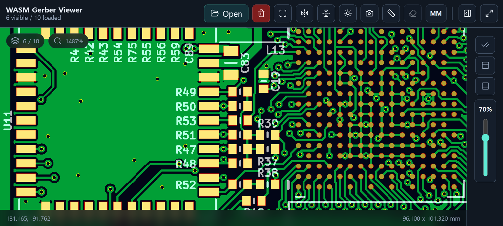

<div align="center">

# wasm-gerber-viewer

本專案是一個基於 WASM/WebGL2 的 Gerber 檔案檢視器，適用於 PCB 視覺化場景。



<br/>

[**`English`**](README.md) · [**`简体中文`**](README.zh-Hans.md) · **`繁體中文`** · [**`한국어`**](README.kr.md)

</div>

---

線上體驗：

- [檢視器](https://wasm-gerber-viewer.vercel.app/) / [鏡像站點](https://dsafdsaf132.github.io/wasm-gerber-viewer/)
- [Sample 1: KLP-5e ESP32 Sensor Board](https://wasm-gerber-viewer.vercel.app/?url=https%3A%2F%2Fraw.githubusercontent.com%2Ffutureshocked%2FKLP-5e-ESP32-sensor-board%2Fmain%2FKiCad%2520project%2Fdfm%2Fgerber.zip)
- [Sample 2: Xassette-Asterisk](https://wasm-gerber-viewer.vercel.app/?url=https%3A%2F%2Fprocessor-cdn.kitspace.org%2Fv6%2FSdtElectronics%2FXassette-Asterisk%2F6ccd88501c99e2339571de744d003d571be47fad%2F_%2FXassette-Asterisk-6ccd885-gerbers.zip)
- [Sample 3: OtterCastAmp](https://wasm-gerber-viewer.vercel.app/?url=https%3A%2F%2Fprocessor-cdn.kitspace.org%2Fv6%2FOttercast%2FOtterCastAmp%2F0b5f7f9a8e4e43a5d39048b9a1fa03e5cf7fc9f7%2F_%2FOtterCastAmp-0b5f7f9-gerbers.zip)
- [功能測試](https://wasm-gerber-viewer.vercel.app/?url=https%3A%2F%2Fwasm-gerber-viewer.vercel.app%2Fdemo%2Fgerber-feature-test.gbr)
- 效能測試 - Stars: [1K](https://wasm-gerber-viewer.vercel.app/?url=https%3A%2F%2Fwasm-gerber-viewer.vercel.app%2Fdemo%2Fperformance-test-stars-1K.gbr), [10K](https://wasm-gerber-viewer.vercel.app/?url=https%3A%2F%2Fwasm-gerber-viewer.vercel.app%2Fdemo%2Fperformance-test-stars-10K.gbr), [100K](https://wasm-gerber-viewer.vercel.app/?url=https%3A%2F%2Fw2f6wchhvqyk5cap.public.blob.vercel-storage.com%2Fdemo%2Fperformance-test-stars-100K.gbr), [1M](https://wasm-gerber-viewer.vercel.app/?url=https%3A%2F%2Fw2f6wchhvqyk5cap.public.blob.vercel-storage.com%2Fdemo%2Fperformance-test-stars-1M.gbr), [5M](https://wasm-gerber-viewer.vercel.app/?url=https%3A%2F%2Fw2f6wchhvqyk5cap.public.blob.vercel-storage.com%2Fdemo%2Fperformance-test-stars-1M.gbr&repeat=5&repeatOffsetX=70), [10M](https://wasm-gerber-viewer.vercel.app/?url=https%3A%2F%2Fw2f6wchhvqyk5cap.public.blob.vercel-storage.com%2Fdemo%2Fperformance-test-stars-1M.gbr&repeat=10&repeatOffsetX=70), [20M](https://wasm-gerber-viewer.vercel.app/?url=https%3A%2F%2Fw2f6wchhvqyk5cap.public.blob.vercel-storage.com%2Fdemo%2Fperformance-test-stars-1M.gbr&repeat=20&repeatOffsetX=70), [50M](https://wasm-gerber-viewer.vercel.app/?url=https%3A%2F%2Fw2f6wchhvqyk5cap.public.blob.vercel-storage.com%2Fdemo%2Fperformance-test-stars-1M.gbr&repeat=50&repeatOffsetX=70), [100M](https://wasm-gerber-viewer.vercel.app/?url=https%3A%2F%2Fw2f6wchhvqyk5cap.public.blob.vercel-storage.com%2Fdemo%2Fperformance-test-stars-1M.gbr&repeat=100&repeatOffsetX=0.007)
- 效能測試 - Single region: [72K](https://wasm-gerber-viewer.vercel.app/?url=https%3A%2F%2Fwasm-gerber-viewer.vercel.app%2Fdemo%2Fperformance-test-region-72K.gbr), [648K](https://wasm-gerber-viewer.vercel.app/?url=https%3A%2F%2Fw2f6wchhvqyk5cap.public.blob.vercel-storage.com%2Fdemo%2Fperformance-test-region-648K.gbr), [1.8M](https://wasm-gerber-viewer.vercel.app/?url=https%3A%2F%2Fw2f6wchhvqyk5cap.public.blob.vercel-storage.com%2Fdemo%2Fperformance-test-region-1.8M.gbr)
- 效能測試 - Arc region: [1.3M](https://wasm-gerber-viewer.vercel.app/?url=https%3A%2F%2Fw2f6wchhvqyk5cap.public.blob.vercel-storage.com%2Fdemo%2Fperformance-test-arc-region-1.3M.gbr)

## 功能特色

- 針對大型 Gerber 檔案（10 MB 以上）最佳化的高效能渲染
- 基於 WASM 與 WebGL2 的硬體加速渲染
- 支援 RS-274X Gerber 渲染
- 支援 NC drill 疊加渲染
- 支援行動裝置觸控操作
- 支援依圖層控制顏色、透明度與可見性
- 支援特徵選取與選取區域醒目提示
- 支援水平/垂直翻轉
- 尺規測量支援 mm/inch 單位切換
- 可依解析度匯出截圖，並可包含尺規覆蓋層

## 快速開始

<details>
<summary>Bash</summary>

```bash
viewer_url="$(
  curl -fsSL https://api.github.com/repos/dsafdsaf132/wasm-gerber-viewer/releases/latest |
  sed -n '/"browser_download_url": .*\/wasm-gerber-viewer-.*\.tar\.gz"/ {
    s/.*"browser_download_url": *"\([^"]*\)".*/\1/p
    q
  }'
)"

curl -fsSL "$viewer_url" | tar -xz &&
cd wasm-gerber-viewer-* &&
python3 -m http.server 8000
```

在瀏覽器中開啟 `http://localhost:8000`，然後上傳 Gerber 檔案。

</details>

<details>
<summary>PowerShell</summary>

```powershell
$viewerUrl = (
  Invoke-RestMethod -Uri "https://api.github.com/repos/dsafdsaf132/wasm-gerber-viewer/releases/latest"
).assets |
  Where-Object { $_.name -match '^wasm-gerber-viewer-.*\.tar\.gz$' } |
  Select-Object -First 1 -ExpandProperty browser_download_url

Invoke-WebRequest -Uri $viewerUrl -OutFile viewer.tar.gz
tar -xzf viewer.tar.gz
Remove-Item viewer.tar.gz
Set-Location ((Get-ChildItem -Directory -Filter "wasm-gerber-viewer-*" | Select-Object -First 1).FullName)

python -m http.server 8000
```

在瀏覽器中開啟 `http://localhost:8000`，然後上傳 Gerber 檔案。

</details>

## 本機建置

如果不使用預先建置的 Release 產物，可以按以下方式在本機重新建置 WASM 套件。

環境需求：

- **Rust stable** - 使用 [rustup](https://rustup.rs/) 安裝
- **wasm-pack** - `cargo install wasm-pack`

```bash
rustup target add wasm32-unknown-unknown
wasm-pack build wasm --target web --out-dir pkg --release
```

## npm 套件

[wasm-gerber-renderer](packages/wasm-gerber-renderer/README.zh-Hant.md)

該套件可在 JavaScript、Node.js 與 CLI 中將 Gerber 檔案渲染為 PNG。
Node.js 與 CLI 渲染透過
[`node-gles-webgl2`](https://github.com/dsafdsaf132/node-gles-webgl2) 支援。

## 專案結構

```text
wasm-gerber-viewer/
├── index.html                         # 應用程式外殼
├── package.json                       # 專案中繼資料與腳本
├── css/
│   └── style.css                      # UI 樣式
├── js/
│   ├── main.js                        # GerberViewer 流程編排與 UI 連接
│   ├── config.js                      # 共用常數與預設值
│   ├── diagnostics.js                 # 診斷面板
│   ├── dom-elements.js                # DOM 元素查詢
│   ├── drawer-controller.js           # 抽屜互動
│   ├── file-utils.js                  # 檔名與錯誤處理工具
│   ├── gerber-parse-worker.js         # Gerber 解析 Web Worker
│   ├── layer-filters.js               # 圖層類型篩選器
│   ├── layer-list.js                  # 圖層清單渲染
│   ├── measurements.js                # 尺規測量與單位顯示
│   ├── notifications.js               # Toast 通知
│   ├── screenshot-exporter.js         # 截圖匯出
│   ├── source-loader.js               # 本機檔案、壓縮檔與 URL 輸入載入
│   ├── viewer-options.js              # 檢視器選項儲存與還原
│   └── viewport.js                    # 相機與 viewport 計算
├── vendor/
│   ├── README.md                      # 內建第三方函式庫說明
│   ├── jszip-3.10.1.min.js            # ZIP 壓縮檔載入
│   ├── lucide-1.16.0.min.js           # UI 圖示
│   └── licenses/                      # 第三方函式庫授權條款
├── packages/
│   └── wasm-gerber-renderer/
│       ├── package.json               # npm 套件設定
│       ├── index.js                   # 瀏覽器渲染器進入點
│       ├── node.js                    # Node.js/無介面渲染器進入點
│       ├── shared.js                  # 瀏覽器/Node 共用邏輯
│       ├── index.d.ts                 # 瀏覽器型別定義
│       ├── node.d.ts                  # Node.js 型別定義
│       ├── bin/                       # gerber-renderer CLI
│       ├── scripts/                   # 打包用 WASM stage/clean 腳本
│       └── test/                      # 套件測試
├── wasm/
│   ├── Cargo.toml                     # Rust crate manifest
│   ├── Cargo.lock                     # Rust dependency lockfile
│   ├── README.md                      # Rust/WASM 管線說明
│   ├── pkg/                           # 產生的 wasm-pack 輸出
│   └── src/
│       ├── lib.rs                     # WASM API 入口
│       ├── drill.rs                   # Excellon/NC drill 解析器
│       ├── interaction.rs             # 特徵選取與醒目提示資料
│       ├── parse_common.rs            # 解析器數字處理共用函式
│       ├── parser.rs                  # Gerber 解析器入口
│       ├── parser/                    # aperture、macro、geometry、state、tests
│       ├── renderer.rs                # WebGL 渲染器
│       ├── renderer/                  # 渲染器模組
│       │   ├── buffer.rs              # GPU 資源結構
│       │   ├── camera.rs              # 變換計算
│       │   ├── shader.rs              # 著色器程式
│       │   └── shaders/               # GLSL 著色器原始碼
│       ├── shape.rs                   # geometry 資料模型
│       └── util.rs                    # 格式化與工具函式
├── demo/                              # 範例與效能測試 Gerber
├── scripts/
│   └── vercel-build.sh                # CI/Vercel WASM 建置腳本
└── .github/workflows/
    ├── build-and-deploy.yml           # 建置、測試與部署工作流程
    ├── renderer-compatibility.yml     # 渲染器套件相容性測試
    └── release.yml                    # 手動 release 工作流程
```

## 瀏覽器需求

需要支援 WebGL2 的現代瀏覽器。

- Chrome 80+, Firefox 75+, Safari 15+, Edge 80+

## 範例來源

範例壓縮檔會從各自的上游專案載入，不包含在本倉庫中。

<details>
<summary>Sample 1: KLP-5e ESP32 Sensor Board</summary>

- Project: [KLP-5e ESP32 Sensor Board](https://github.com/futureshocked/KLP-5e-ESP32-sensor-board)
- Copyright: Copyright (c) 2025, Peter Dalmaris
- License: CERN-OHL-S v2.0
- Archive: <https://raw.githubusercontent.com/futureshocked/KLP-5e-ESP32-sensor-board/main/KiCad%20project/dfm/gerber.zip>

</details>

<details>
<summary>Sample 2: Xassette-Asterisk</summary>

- Project: [Xassette-Asterisk](https://github.com/SdtElectronics/Xassette-Asterisk)
- Copyright: SdtElectronics
- License: CERN-OHL-W v2.0
- Archive: <https://processor-cdn.kitspace.org/v6/SdtElectronics/Xassette-Asterisk/6ccd88501c99e2339571de744d003d571be47fad/_/Xassette-Asterisk-6ccd885-gerbers.zip>

</details>

<details>
<summary>Sample 3: OtterCastAmp</summary>

- Project: [OtterCastAmp](https://github.com/Ottercast/OtterCastAmp)
- Copyright: Copyright (c) 2021 Ottercast, Niklas Fauth
- License: MIT License
- Archive: <https://processor-cdn.kitspace.org/v6/Ottercast/OtterCastAmp/0b5f7f9a8e4e43a5d39048b9a1fa03e5cf7fc9f7/_/OtterCastAmp-0b5f7f9-gerbers.zip>

</details>

## 授權

[MIT License](LICENSE)
