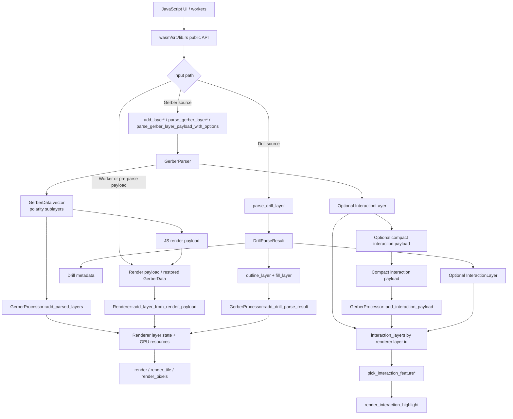
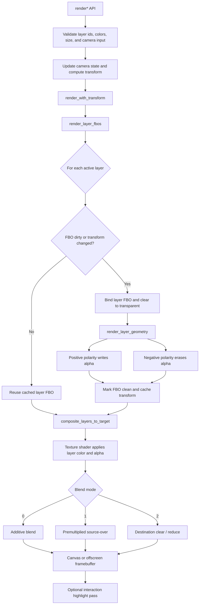

# Rust/WASM Pipeline

This document describes the Rust pipeline under `wasm/src`. The JavaScript UI
and workers provide input, options, layer order, and camera state. Rust/WASM
handles parsing, geometry storage, WebGL rendering, CPU picking, and highlight
rendering.

## Overall Rust/WASM Pipeline

### 1. WASM Entry Points

The public boundary is mostly defined in `wasm/src/lib.rs`.

Key APIs:

- `init_panic_hook()`: installs browser-console panic reporting.
- `reserve_input_capacity(byte_count)`: preflights large JS-to-WASM input
  copies with catchable allocation errors.
- `parse_gerber_layer*()`: parses Gerber input and returns JS render geometry
  payloads.
- `parse_gerber_layer_payload_with_options()`: parses Gerber once and returns
  both the render payload and a compact interaction payload.
- `parse_drill_layer()`: parses Excellon/NC drill input into outline/fill
  payloads.
- `GerberProcessor::add_layer*()`: parses source directly inside the stateful
  renderer instance.
- `GerberProcessor::add_render_payload()`: uploads worker/pre-parse render
  payloads into WebGL buffers.
- `GerberProcessor::add_interaction_payload()`: restores compact interaction
  payloads for an already-created renderer layer id.
- `GerberProcessor`: owns the stateful WebGL renderer, parser options, drill
  options, and optional interaction indexes.

### 2. Gerber Parsing

Gerber parsing starts in `wasm/src/parser.rs`.

Important functions:

- `parse_gerber_with_options(content, preserve_arc_regions, arc_tessellation_quality)`
- `parse_gerber_payload_with_options(...)`
- public wrapper `parse_gerber_layer_payload_with_options(...)`
- `GerberParser`

The parser processes the file in object-stream order and emits polarity
sublayers. The render output is `Vec<GerberData>`, where each `GerberData`
represents one polarity batch within a user layer.

High-level flow:

1. Build aperture, aperture macro, and parser state.
2. Convert graphic commands into primitives.
3. Build region contours and path-region data.
4. Split output when polarity or block-aperture boundaries require it.
5. Drop empty geometry batches.
6. If interaction is enabled, build an `InteractionLayer` alongside render
   geometry.
7. If the result must cross the JS/worker boundary, encode the
   `InteractionLayer` as a compact table payload instead of expanding feature
   metadata into JS objects.

### 3. Drill Parsing

Drill parsing lives in `wasm/src/drill.rs`.

Important functions:

- `parse_drill_with_offset(...)`
- `parse_drill_with_offset_and_interactions(...)`

Drill input is split into two render layers:

- `outline_layer`: plated ring or outline geometry.
- `fill_layer`: hole clear/fill geometry.

`DrillParseResult` contains both render layers, metadata, and an optional
interaction layer. `GerberProcessor::add_drill_parse_result()` adds outline and
fill as separate renderer layers, stores the outline id for later option
updates, and returns `outlineLayerId`, `fillLayerId`, and metadata to JS.

### 4. Geometry Model

The shared geometry model is in `wasm/src/shape.rs`.

Important types:

- `GerberData`: one renderable polarity sublayer.
- `Boundary`: min/max bounds.
- `Lines`, `Circles`, `Arcs`, `Thermals`, `TriangleTemplateInstances`.
- `PathRegions`: region/path based geometry.

`GerberData` supports JS render-payload conversion. This lets a worker, or a
main-thread pre-parse helper, parse geometry outside the stateful renderer
instance and pass render buffers into `add_render_payload()`. Feature picking
data uses a separate compact interaction payload from `wasm/src/interaction.rs`
so aperture strings, descriptors, templates, primitives, and path-region data
can remain table-based across the JS boundary.

### 5. Processor State

`GerberProcessor` keeps the top-level state:

- `renderer: Option<Renderer>`: WebGL renderer.
- `preserve_arc_regions`, `arc_tessellation_quality`: parser options.
- `minimum_feature_pixels`: display-size adjustment for tiny features.
- `drill_outline_pixels`: drill outline expansion in screen pixels.
- `drill_outline_layer_ids`: drill outline layers that need option updates.
- `interaction_enabled`, `interaction_layers`: CPU picking data.

When interaction is disabled, `set_interactions_enabled(false)` clears stored
interaction indexes. Worker callers should use the render-only parse path, and
`add_interaction_payload()` ignores payloads while interaction is disabled.

The viewer normally treats rendering and Gerber feature picking as two phases:

1. A render processor receives render geometry first and owns the visible WebGL
   layer FBOs.
2. After render layer records are committed, JS may create a separate
   interaction processor and restore compact Gerber interaction payloads into
   matching renderer layer ids with `add_interaction_payload()`.

This split prevents Gerber picking-index construction failures from discarding
already-rendered layers. If phase 2 fails, JS disables feature picking for the
whole document and keeps the render processor alive. Drill picking currently
uses interaction data created by the direct drill parse path on the render
processor, so JS routes drill picking to the render processor and Gerber picking
to the interaction processor when one exists.

Layer-add flow:

1. JS calls `add_layer`, `add_layer_with_offset`, `add_render_payload`, or
   `add_drill_layer`.
2. Rust parses source text directly in `add_layer*()`/`add_drill_layer*()`, or
   restores `GerberData` from render payloads in `add_render_payload()`.
3. `Renderer::add_layer()` or `Renderer::add_layer_from_render_payload()`
   creates renderer layer metadata and GPU resources.
4. If interaction is enabled during direct parsing, the matching
   `InteractionLayer` is stored by renderer layer id.
5. If parsing happened outside the renderer instance, JS first commits the
   render layer record, then phase 2 calls `add_interaction_payload()` with the
   renderer layer id so Rust can restore the compact interaction payload into
   `interaction_layers`.

### 6. Interaction Pipeline

Interaction data is implemented in `wasm/src/interaction.rs`.

Important types:

- `InteractionLayer`
- `InteractionFeature`
- `FeatureKind`

Viewer worker/pre-parse transfer flow:

1. A worker, or main JS before creating a staged renderer layer, calls
   `parse_gerber_layer_payload_with_options()`.
2. Rust parses the file once, producing render geometry and an
   `InteractionLayer`.
3. Rust returns `renderPayload` plus `interactionPayload`.
4. The interaction payload stores repeated data in shared string, descriptor,
   template, primitive, and path-region tables.
5. Main JS calls `add_render_payload()` on the render processor first.
6. After the render layer is committed, JS calls `add_interaction_payload()` on
   the interaction processor for the returned renderer layer id.
7. If any phase-2 payload restore fails, JS discards the interaction processor
   and disables picking for the whole document rather than leaving partial
   picking data active.

This avoids reparsing the source on the main thread and avoids expanding
repeated aperture metadata into per-feature JS objects.

`build_layer_interactions()` still exists as a compatibility API for building
an interaction layer after `add_render_payload()`, but it reparses source text
and is not the current viewer pipeline.

CPU picking flow:

1. JS converts click/touch coordinates into world coordinates.
2. JS passes visible interaction layer ids and a world-space tolerance to
   `pick_interaction_feature()`. Drill ids are queried on the render processor;
   Gerber ids are queried on the interaction processor when one exists.
3. Rust scans layer ids in reverse order. For Gerber layers, the viewer's
   `layers` array follows the layer-list UI order, top-to-bottom, so JS
   reverses visible Gerber ids into bottom-to-top order before calling Rust.
   Drill layers are rendered in `layers` order, so JS passes visible drill ids
   in that render order and lets Rust's reverse scan test the last rendered
   drill first.
4. Repeated picking at nearly the same location uses
   `pick_interaction_feature_after()` to cycle to the next candidate.
5. Rust returns structured feature metadata, not display strings.

Highlight flow:

1. JS stores the selected `layerId` and `featureId`.
2. After normal rendering, JS calls `render_interaction_highlight()`.
3. Rust looks up the stored `InteractionFeature`.
4. WebGL highlight passes render the selected area.

## Rendering Pipeline

Rendering is implemented by `Renderer` in `wasm/src/renderer.rs`.

The key design point is that final color alpha is not applied while drawing
individual geometry primitives. Instead, each user layer is first rendered into
its own FBO as a layer mask, and final color/alpha is applied only when those
layer FBOs are composited to the target canvas.

This avoids intra-layer alpha accumulation. If flashes, lines, regions, or arcs
inside the same file overlap, the overlap should not become a different color
just because the same layer was drawn multiple times.

### 1. Renderer Initialization

Initialization paths:

- `GerberProcessor::init(gl)` -> `Renderer::new(gl)`
- `GerberProcessor::init_with_size(gl, width, height)` ->
  `Renderer::new_headless(...)`

The renderer owns shader programs, shared buffers, layer FBOs, geometry buffer
caches, and highlight resources.

### 2. Layer Registration

`Renderer::add_layer(gerber_data: Vec<GerberData>)` registers one user layer.
The `Vec<GerberData>` is the list of polarity sublayers for that user layer.

Registration creates or prepares:

- layer metadata.
- one FBO for the user layer.
- sublayer buffer caches.
- bounds.
- uploaded geometry or render payload backed buffers.

`add_layer_from_render_payload()` is the worker-to-main-renderer path. It avoids
reparsing source text in the main renderer when a worker has already produced a
render payload. When feature picking is enabled, the caller pairs this with
phase-2 `add_interaction_payload()` on the interaction processor so CPU picking
data is restored without a second source parse and without risking the render
processor if picking data cannot be built.

### 3. Render Call Stack

JS usually calls one of these APIs:

- `render(active_layer_ids, color_data, zoom_x, zoom_y, offset_x, offset_y, alpha)`
- `render_with_clear(...)`
- `render_with_clear_and_blend_modes(..., blend_modes, ..., clear_canvas)`
- screenshot/headless variants such as `render_tile*()` and `render_pixels*()`

Most paths converge to:

1. Validate render input.
2. Update camera state.
3. Compute the transform matrix.
4. Call `render_with_transform(...)`.
5. Call `render_layer_fbos(...)`.
6. Call `composite_layers(...)`.

### 4. Layer FBO Rendering

`render_layer_fbos(active_layer_ids, transform, width, height)` prepares each
active layer's FBO.

A layer FBO is redrawn only when:

- the layer is dirty, or
- the cached FBO transform differs from the current transform.

When redrawing:

1. Bind the layer FBO.
2. Clear it to transparent black.
3. Call `render_layer_geometry(layer_idx, transform, width, height)`.
4. Mark the layer clean and cache the transform.

### 5. Geometry Rendering Inside One Layer

`render_layer_geometry()` draws all polarity sublayers inside one user layer.

Rules:

- Positive polarity fills alpha in the layer FBO.
- Negative polarity erases alpha in the layer FBO.
- Final layer color and final layer alpha are not applied here.

Geometry types drawn in this pass:

- triangles.
- triangle templates.
- lines.
- circles.
- arcs.
- thermals.
- path regions.

This pass is what prevents same-layer overlaps from changing color. The FBO is
treated as the material mask for that user layer, not as the final colored
image.

### 6. Final Canvas Composition

`composite_layers_to_target(...)` composites layer FBO textures into the final
target, which can be the visible canvas or an offscreen framebuffer.

Inputs:

- `active_layer_ids`: layer order chosen by JS.
- `color_data`: RGB or RGBA per active layer.
- `alpha`: global alpha.
- `blend_modes`: optional per-layer composite mode.
- `clear_canvas`: whether to clear the target first.

For each layer:

- if `color_data` is RGBA, `layer_alpha = color_data.a * alpha`.
- if `color_data` is RGB, `layer_alpha = alpha`.
- the texture shader multiplies FBO alpha by the layer color alpha and emits
  premultiplied color.

Current blend mode meanings:

- `0`: additive composition, `blend_func(ONE, ONE)`.
- `1`: premultiplied source-over style composition,
  `blend_func_separate(ONE, ONE_MINUS_SRC_ALPHA, ONE, ONE_MINUS_SRC_ALPHA)`.
- `2`: clear/reduce destination using source alpha,
  `blend_func_separate(ZERO, ONE_MINUS_SRC_ALPHA, ZERO, ONE_MINUS_SRC_ALPHA)`.

Drill outline and fill/clear behavior relies on these modes.

### 7. Screenshot and Headless Rendering

Screenshot export uses the same renderer pipeline.

- Single-image export renders one tile into an offscreen WebGL canvas.
- Large export renders multiple tiles with `render_tile*()`.
- Each tile still follows the layer FBO pass and final composite pass.
- Measurement overlay is drawn later on a 2D canvas.

### 8. Highlight Rendering

Selected-feature highlight is an extra pass after normal layer composition.

Flow:

1. Normal layer rendering finishes.
2. JS calls `render_interaction_highlight(layer_id, feature_id, camera...)`.
3. Rust retrieves the stored `InteractionFeature`.
4. Highlight shaders render the selected area, using stencil/blend state as
   needed.

The visible app render includes highlight after normal layer composition.
Screenshot export intentionally omits selected-feature highlight and only draws
measurements after the WebGL render.

### 9. Performance Invariants

- Geometry upload and layer FBO redraws happen only when needed.
- Camera transform changes invalidate the layer FBO result.
- Color, alpha, and layer order changes should only require the final composite
  pass when possible.
- Final alpha must not be applied during the per-geometry layer pass.
- Layer display policy should be implemented at the FBO composite stage, not in
  primitive drawing.
